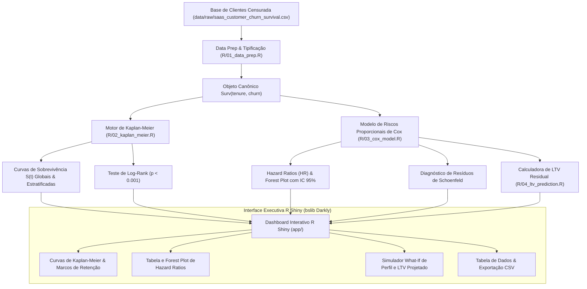

# ️ Customer Churn Survival Analysis & LTV Modeling in R

[](https://github.com/Renanbritto/customer-churn-survival-analysis/actions/workflows/r-ci.yml)
[](https://www.r-project.org/)
[](https://testthat.r-lib.org/)
[](https://shiny.posit.co/)
[-purple.svg)](https://rstudio.github.io/bslib/)
[](LICENSE)

Pipeline estatístico avançado desenvolvido em **R** para **Análise de Sobrevivência (Survival Analysis)** aplicada à retenção de clientes e mitigação de churn em modelos de assinatura (SaaS e Telecom). O projeto combina tratamento de **dados censurados à direita**, estimador não-paramétrico de **Kaplan-Meier**, teste de **Log-Rank**, regressão semiparamétrica de **Riscos Proporcionais de Cox (Hazard Ratios)**, cálculo dinâmico de **LTV residual** e **dashboard interativo em R Shiny**.

---

##  Por que Análise de Sobrevivência em vez de Classificação Tradicional?

Na maioria das empresas, o churn é modelado através de classificadores binários padrão (como Regressão Logística, Random Forest ou XGBoost). Embora populares, esses modelos sofrem de **duas falhas metodológicas críticas**:

1. **Ignoram a Dimensão Temporal (Time-to-Event):** Um cliente que cancela no mês 1 gera um prejuízo operacional e de CAC incomparavelmente maior do que um cliente que cancela após 36 meses de retenção lucrativa. Modelos de classificação tratam ambos os casos como idênticos ($Y = 1$).
2. **Viés de Censura (Right-Censoring Bias):** Clientes atualmente ativos na base não são "não-churners definitivos" — eles apenas *ainda não cancelaram* até o momento do corte dos dados. Rotulá-los como $Y = 0$ subestima severamente o risco real de cancelamento da carteira.

A **Análise de Sobrevivência** resolve ambos os problemas ao modelar a distribuição contínua do tempo até o cancelamento $T$, permitindo estimar a probabilidade de sobrevivência $S(t) = P(T > t)$, a taxa instantânea de risco $h(t)$ e a expectativa de vida útil residual do cliente.

---

##  Fundamentação Matemática & Estatística

### 1. Função de Sobrevivência e Estimador de Kaplan-Meier
A função de sobrevivência representa a probabilidade de um cliente permanecer ativo além do tempo $t$:

$$S(t) = P(T > t) = 1 - F(t)$$

Para lidar com observações censuradas à direita sem viés de seleção, utilizamos o **Estimador Produto-Limite de Kaplan-Meier**:

$$\hat{S}(t) = \prod_{t_i \le t} \left( 1 - \frac{d_i}{n_i} \right)$$

Onde:
- $t_i$: Tempo ordenado em que ocorreram cancelamentos ($t_1 < t_2 < \dots < t_k$).
- $d_i$: Número de clientes que cancelaram exatamente no instante $t_i$.
- $n_i$: Número de clientes ainda em risco (ativos e sob observação) imediatamente antes de $t_i$.

---

### 2. Teste de Hipótese Log-Rank
Utilizado para testar formalmente se as funções de sobrevida de diferentes grupos (ex: Contrato Mensal vs Anual vs Bianual) são estatisticamente equivalentes ($H_0: S_1(t) = S_2(t) = \dots = S_k(t)$):

$$\chi^2 = \sum_{j=1}^k \frac{\left( \sum_{i} (O_{ji} - E_{ji}) \right)^2}{\sum_{i} V_{ji}} \sim \chi^2_{k-1}$$

Onde $O_{ji}$ representa os eventos observados e $E_{ji}$ os eventos esperados sob a hipótese nula no estrato $j$.

---

### 3. Modelo de Riscos Proporcionais de Cox
Modela a intensidade instantânea de cancelamento (função de risco $h(t)$) em função de um vetor de características do cliente $X = (X_1, X_2, \dots, X_p)$:

$$h(t | X) = h_0(t) \cdot \exp\left( \beta_1 X_1 + \beta_2 X_2 + \dots + \beta_p X_p \right)$$

Onde:
- $h_0(t)$: Taxa de risco basal não-paramétrica (não requer suposição distribucional rígida).
- $\exp(\beta_j) = \text{Hazard Ratio (HR)}$: Razão de risco associada ao incremento de 1 unidade na covariável $X_j$:
  - **$\text{HR} > 1$ (Fator de Risco):** Aumenta o risco de cancelamento (ex: cada chamado adicional no suporte aumenta o risco instantâneo em +28%).
  - **$\text{HR} < 1$ (Fator de Proteção):** Reduz o risco de cancelamento (ex: contrato anual reduz o risco de cancelamento em -74% comparado ao mensal).

**Verificação da Premissa de Proporcionalidade:**  
Avaliamos a estabilidade temporal dos coeficientes através do teste dos **Resíduos Escalonados de Schoenfeld** ($p > 0.05$ atesta a validade da premissa).

---

### 4. Expectativa de Vida Residual (RMST) e Cálculo Dinâmico de LTV
O tempo médio de permanência restrito a um horizonte $\tau$ (Restricted Mean Survival Time):

$$\text{RMST}(\tau) = \int_0^\tau S(t) \, dt$$

O **Valor Vitalício Residual (LTV Descontado)** projetado para um cliente com mensalidade $M$, sob taxa mensal de desconto intertemporal $r \approx 0.8\%$ a.m. (~10% a.a.):

$$\text{LTV}_{\text{descontado}} = \sum_{t=1}^{\tau} \frac{M \cdot S(t | X)}{(1 + r)^t}$$

---

## ️ Arquitetura da Solução



---

##  Stack Tecnológica

| Camada | Pacote R | Finalidade |
|---|---|---|
| **Estatística & Sobrevivência** | `survival` | Formulação de objetos `Surv()`, estimadores `survfit()`, regressão `coxph()` e testes `survdiff()` |
| **Visualização Avançada** | `survminer` & `ggplot2` | Curvas de sobrevida com faixas de confiança e tabelas de risco |
| **Interatividade Web** | `plotly` | Gráficos responsivos, hover unificado e forest plots interativos |
| **Dashboard Executivo** | `shiny` & `bslib` | Aplicação web com tema escuro nativo (Bootstrap 5) e componentes reativos |
| **Manipulação de Dados** | `dplyr`, `tidyr`, `readr` | Transformação de dados, ordenação de fatores e cálculo de integrais numéricas |
| **Tabelas Interativas** | `DT` | Renderização dinâmica de tabelas com paginação e busca |
| **Testes & CI/CD** | `testthat` & GitHub Actions | Testes unitários com validação estrita no GitHub Actions (`r-lib/actions/setup-r`) |

---

##  Estrutura do Repositório

```
customer-churn-survival-analysis/
├── .github/
│   └── workflows/
│       └── r-ci.yml                 # Pipeline automatizado de CI no GitHub Actions
├── data/
│   ├── raw/
│   │   └── saas_customer_churn_survival.csv  # 2.500 clientes com variáveis de contrato e uso
│   └── processed/
├── R/
│   ├── 01_data_prep.R               # Validação, tipagem e criação do objeto Surv()
│   ├── 02_kaplan_meier.R            # Curvas KM, tabela de marcos temporais e Log-Rank
│   ├── 03_cox_model.R               # Regressão de Cox, Hazard Ratios e resíduos de Schoenfeld
│   └── 04_ltv_prediction.R          # Projeção de sobrevida individual e LTV descontado
├── app/
│   ├── global.R                     # Pré-carregamento de dados, pacotes e modelos
│   ├── ui.R                         # Interface visual executiva em bslib (Dark Theme)
│   └── server.R                     # Lógica reativa, renderizações Plotly e simulador What-If
├── tests/
│   ├── testthat/
│   │   ├── test_data_prep.R         # Testes de tipagem, integridade e censura
│   │   ├── test_kaplan_meier.R      # Testes de monotonia de S(t) e Log-Rank
│   │   └── test_cox_model.R         # Testes de Hazard Ratios e consistência de LTV
│   └── testthat.R                   # Runner de testes do pacote
├── DESCRIPTION                      # Metadados e dependências do projeto R
├── .gitignore                       # Filtro de arquivos temporários do R e RStudio
└── README.md                        # Documentação técnica e executiva completa
```

---

##  Como Executar Localmente

### Pré-requisitos
Certifique-se de possuir o [R (>= 4.2.0)](https://cran.r-project.org/) instalado em seu sistema (ou utilize o RStudio / Positron).

### 1. Clonar o repositório:
```bash
git clone https://github.com/Renanbritto/customer-churn-survival-analysis.git
cd customer-churn-survival-analysis
```

### 2. Instalar os pacotes necessários:
Abra o console do R e execute:
```R
install.packages(c(
  "survival", "survminer", "dplyr", "tidyr", 
  "readr", "ggplot2", "plotly", "shiny", 
  "bslib", "DT", "testthat"
))
```

### 3. Rodar a bateria de testes unitários:
```R
library(testthat)
r_files <- list.files("R", pattern = "\\.R$", full.names = TRUE)
for (f in r_files) source(f)
test_dir("tests/testthat")
```

### 4. Iniciar o Dashboard Interativo em R Shiny:
```R
shiny::runApp("app")
```
O aplicativo será iniciado localmente (geralmente em `http://127.0.0.1:port`), disponibilizando o simulador de tempo de retenção, as curvas de Kaplan-Meier e o Forest Plot de Hazard Ratios.

---

## ️ Licença

Distribuído sob a licença MIT.

---

**Desenvolvido por Renan Nocelli Britto**  
*Cientista de Dados & Engenheiro de Software* • [LinkedIn](https://www.linkedin.com/in/renan-nocelli-britto/) • [Portfólio](https://renan-nocelli.vercel.app/)